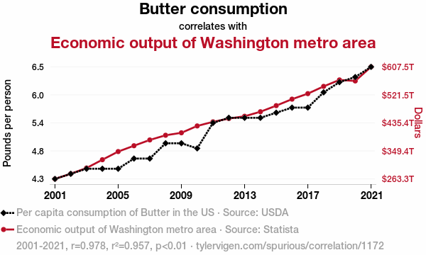

# Background & Motivation for Causal Inference in Service Evaluations

When performing evaluations of healthcare services or interventions in the NHS, our key evaluation question of interest is almost always causal in nature: • Has our new breast cancer screening programme reduced mortality? • Did implementing a community-based model of care divert patients away from A&E services? • Did implementing a hub and spoke model reduce clinical harm and lower patient waiting times?

Yet many of the methods currently used to evaluate interventions within the NHS are often descriptive in nature. Dashboards are frequently used in this manner, where any changes in an outcome of interest are fully attributed to a single change in implementation in services, without considering whether there are alternative explanations and/or other confounding factors are involved that could instead explain the change instead.

To better illustrate this point, Tyler Vigen publishes great examples of spurious correlations on his webpage (https://tylervigen.com/spurious-correlations), from which I’ve attached an example of below @vigenTylerVigenSpurious2024:

