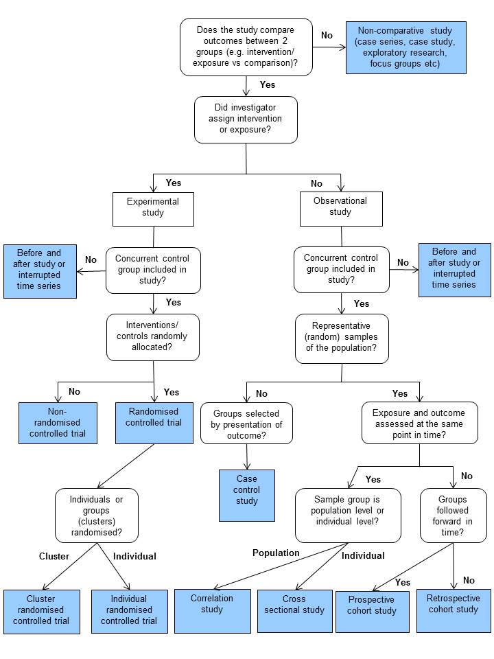
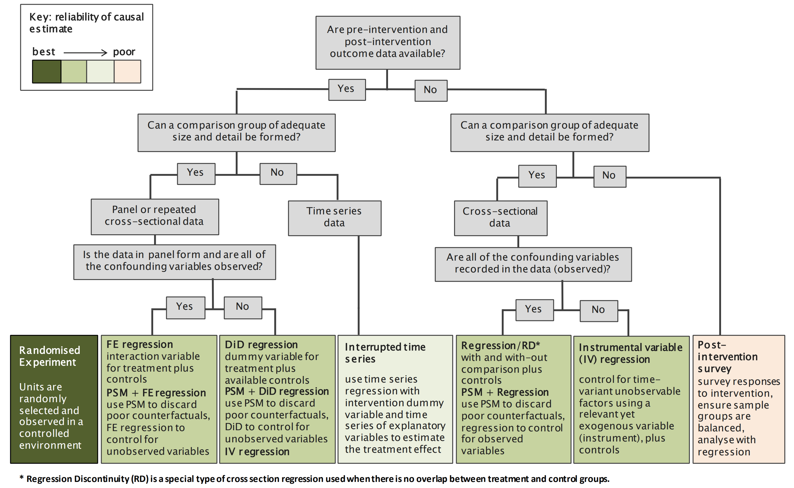
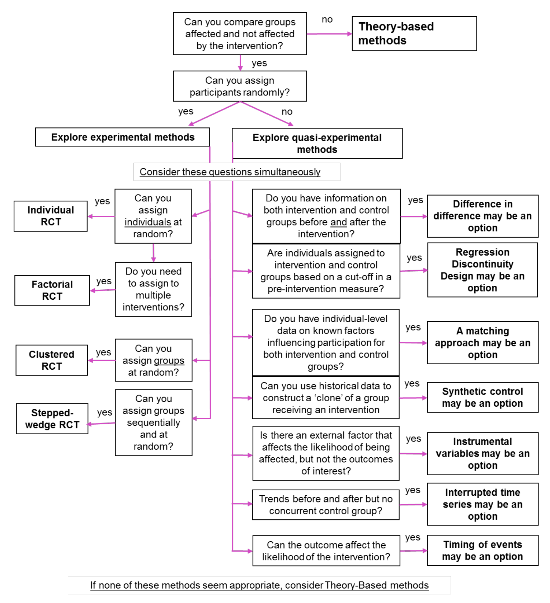

# Existing Guidance on Study Design Selection

Prior to presenting my unifying guidance in my next section, I’ve attached a few existing reports and guides for selecting the appropriate observational causal study design relevant to your key evaluation question of interest. This was done to acknowledge the work that has come before, while also noting key limitations that motivated the development of this unifying guidance.

\

## NICE Guidance

In their report on “methods for the development of NICE public health guidelines,” the National Institute for Health and Care Excellence (NICE) provides a high-level overview of the various epidemiological study designs used in public health research. Included within the report in Appendix E is a flowchart that outlines an “algorithm for classifying quantitative (experimental and observational) study designs [@niceAppendixAlgorithmClassifying2012].

As you can see, the types of study designs covered are very general, and do not focus on specific types of analytical methods you can use to deal with confounding factors within your study to derive causal inferences. As such, this diagram is most useful for those who are new to the field of epidemiology and public health, and wish to refer to a general overview of experimental and observational study designs.

\

## OHID Guidance

The Office for Health Improvement and Disparities (OHID) has similarly published some high-level guidance on the use of various evaluation methods, including quasi-experimental methods, to evaluate digital health products [@ohidGuidanceChooseEvaluation2021; @ohidGuidanceQuasiexperimentalStudy2021]. This guidance is aimed at analysts that are completely new to these methods though, and as such does not go into the specifics of how to perform these analyses in a programming language and/or statistical package such as R, Stata, and Python.

\

## New Zealand Transport Agency Guidance

The New Zealand Transport Agency Waka Kotahi has published a report focused on the use of causal inference methods for the evaluation of transport interventions, and includes a causal inference method selection flowchart [@schiffExpostEvaluationTransport2017].

The methods included are limited to those most often used in the social sciences and econometrics though. These methods largely exploit natural experiments that have occurred in the real world at one point in time to derive causal inferences. There is hence room to expand upon this flowchart further in a more comprehensive manner.

\

## HM Treasury Guidance

The HM Treasury’s Magenta Book, specifically Figure 3.1 on p.47 (PDF p.54) provides a great diagram providing guidance on when using different experimental and quasi-experimental methods for service evaluation would be the most appropriate [@hmtreasuryMagentaBookCentral2020]. Unlike the New Zealand Transport Agency’s guidance, the Treasury’s diagram is more descriptive in nature, describing specific contexts where each approach would be most applicable.

However, similar to the New Zealand Transport Agency’s guidance, the quasi-experimental methods presented only encompass methods used more often in econometrics and social sciences, such as difference in differences and regression discontinuity.

These methods once again largely exploit natural experiments that have occurred in the real world to derive causal inferences, rather than adjusting for individual covariates which is more popular in epidemiology. Methods focusing on the latter are absent, but this is no surprise due to the Treasury’s area of focus. The guidance presented in this handbook therefore expands upon this diagram to also include such methods.

