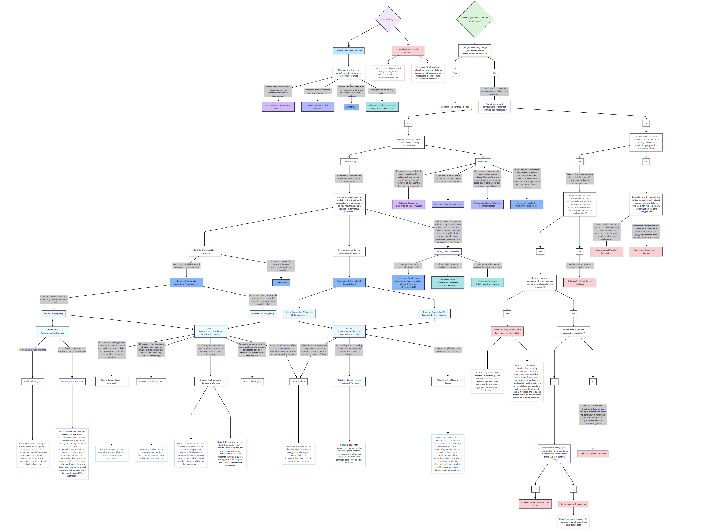

# New Unifying Guidance on Choosing Causal Inference Methods (Method Selection Tree)

Given the narrow scope of all prior guidance, especially as most of the methods selection diagrams are limited to methods used more within other fields of study, I have opted to create a new method selection tree diagram to help advise with the selection of causal methods going forward.

A flowchart of all methods mentioned in this handbook is presented below, with descriptors indicating which variables are most appropriate given your evaluation question of interest, and the data available to you. Corresponding chapter numbers of each method are also attached within the flowchart.

**Please note that the diagram is still a work in progress, and will continue to be updated with input from external experts.**

::: {.content-visible when-format="html"}

:::

::: {.content-visible when-format="pdf"}

:::