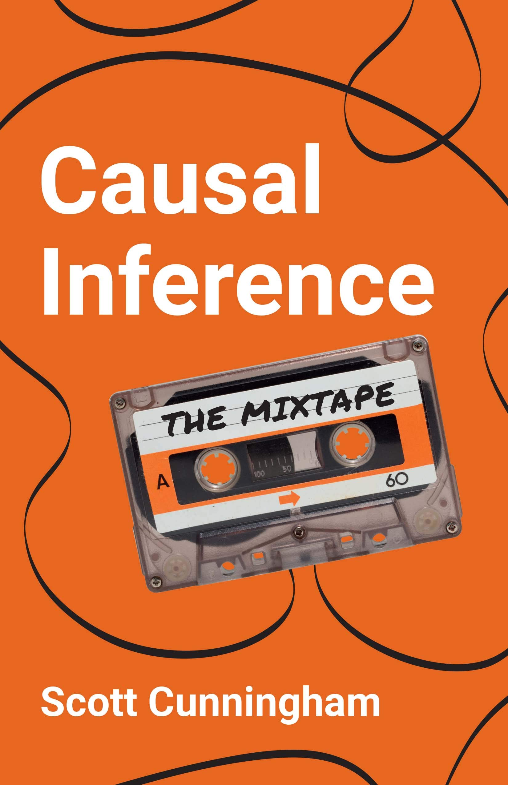
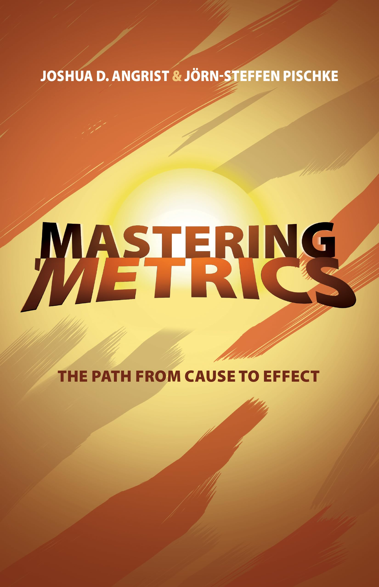
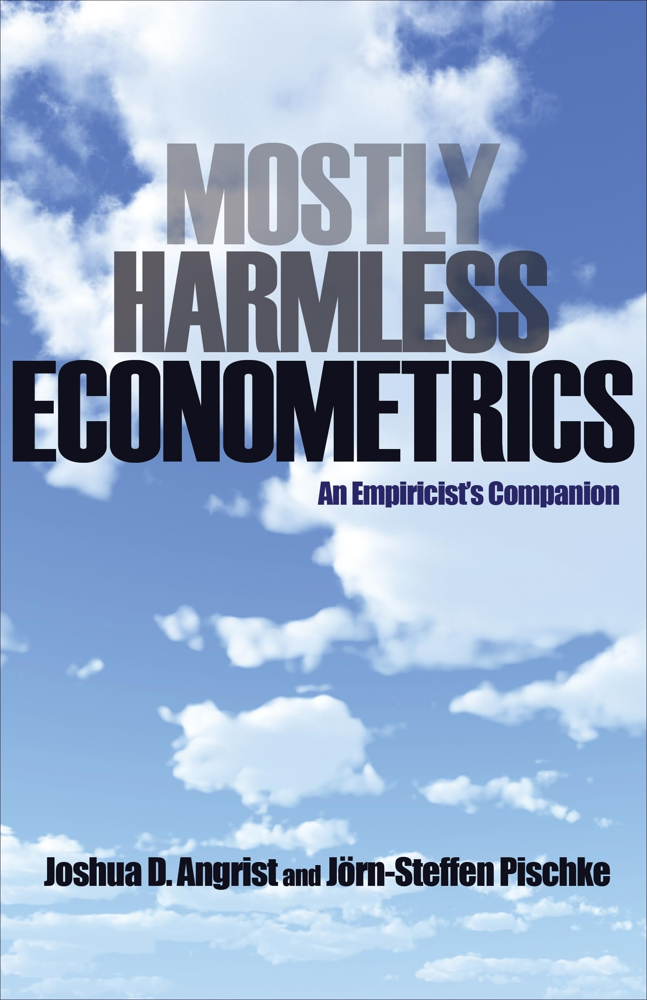
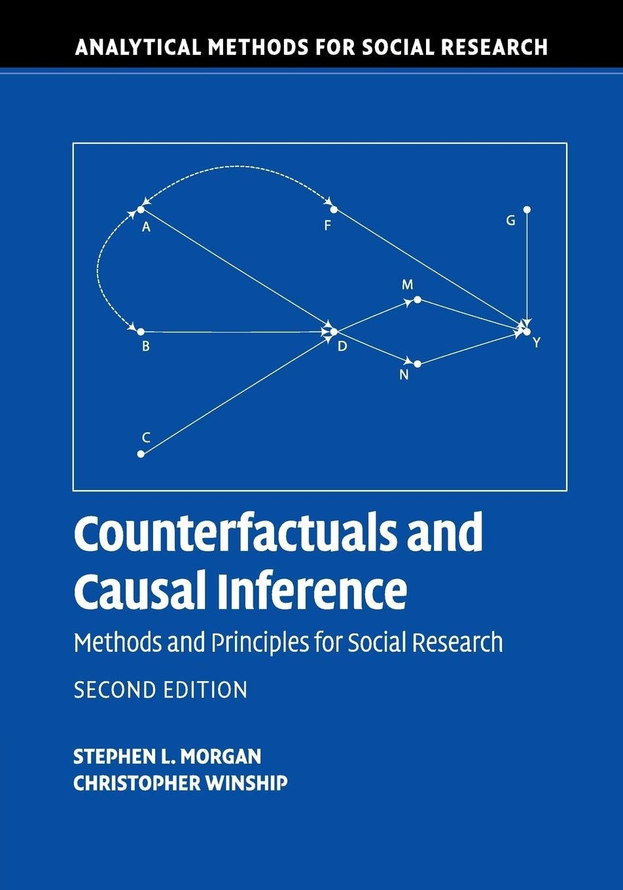

# Key Resources

Throughout the handbook, there are a few key influential texts that have consolidated contemporary methods used to derive causal inferences from observational data. These texts are widely regarded as being foundational to anyone attempting to dip their toes into the field, and are often used as required reading and/or reference material within undergraduate and postgraduate courses in the econometrics, epidemiology, statistics, and social sciences more broadly.

I’ve listed some the most frequently cited texts in this handbook below, along with a brief description of their areas of focus. Additional texts that are beyond the scope of this handbook have also been included for reference. A summary table is also included showing which methods are covered by each book in Section 1.7.

Brady Neal has posted a very useful flowchart on his personal website outlining “which causal inference book you should read,” and covers many of the texts mentioned in this handbook [@nealWhichCausalInference2019]. If you’re completely new to the field of causal inference, his diagram serves as a great place to begin your journey. 

::: {.content-visible when-format="html"}
<figure style="text-align: center;">
  
  <figcaption>
    Causal Books Flowchart (Neal, 2019)
  </figcaption>
</figure>
:::

::: {.content-visible when-format="pdf"}

:::

\

## Causal Inference: What If [@hernanCausalInferenceWhat2025]

{width=220}

**Authors**  
Miguel Hernan – *Kolokotrones Professor of Biostatistics and Epidemiology, Harvard T.H. Chan School of Public Health & Director of Harvard CAUSALab*

James M. Robins – *Mitchell L. and Robin LaFoley Dong Professor of Epidemiology, Harvard T.H. Chan School of Public Health*

**Content**  
Hernan and Robins’ book was first published in 2020, and has been continuously updated over the past few years. The most up to date version of the book can be found on [Hernan’s personal webpage](https://miguelhernan.org/whatifbook).

The book is considered by many in the field of epidemiology to be the definitive guide to the application of causal inference methods, framed within the target trial emulation framework, especially when it comes to estimating causal effects using complex longitudinal data (with a strong focus on G-methods). This is a result of the book being openly available online for the past two decades while it was still being drafted, with many researchers in the field contributing to the book over this period.

The book is particularly useful in providing guidance for evaluating sustained and time-varying treatment strategies, and overcoming issues such as immortal time bias within classical methods in epidemiology, which are often issues within the field of pharmacoepidemiology.

The book also (very helpfully) includes accompanying R and Stata code hosted on [GitHub](https://remlapmot.github.io/cibookex-r/), which provides practical examples of how the methods covered can be applied to your own data.

\

## Causal Inference: The Mixtape [@cunninghamCausalInferenceMixtape2021]

{width=220}

**Author**  
Scott Cunningham – *Ben H. Williams Professor of Economics at Baylor University*

**Content**  
Cunningham’s book aimed to consolidate many of the causal inference methods from econometrics (e.g., regression discontinuity, instrumental variables, difference-in-differences) that were scattered across various other textbooks, and in addition provides worked examples of Stata, R, and Python code for each section. 

More specifically, Cunningham was mainly inspired by the work of Morgan and Winship, Angrist and Pischke, as well as Imbens and Rubin, which are all cited in this handbook as well. However, unlike these other texts, Cunningham’s book is written in a very approachable manner for beginners, and is a great starting point to get to develop an understanding of various types of causal inference methods from an economist’s perspective.

The book and accompanying code is available openly [online](https://mixtape.scunning.com/).

Cunningham has also begun hosting a course based on the contents of the book, and has posted all the accompanying content (both slides and code) onto his [GitHub page](https://github.com/Mixtape-Sessions) for those who wish to delve deeper into the history and application of these methods.

\

## Mostly Harmless Econometrics: An Empiricist’s Companion [@angristMostlyHarmlessEconometrics2009] & Mastering ‘Metrics: The Path from Cause to Effect [@angristMasteringMetricsPath2015]

{width=220}

{width=220}

**Authors**  
Joshua D. Angrist – *Ford Professor of Economics at MIT and Nobel Prize Laureate (Economics)*

Jörn-Steffen Pischke – *Professor of Economics at LSE*

**Content**  
Angrist and Pischke have written two textbooks on causal methods in econometrics, covering largely the same topics and methods across both: randomized trials, regression modelling, instrumental variables, regression discontinuity designs, and differences-in-differences. 

However, Mastering ‘Metrics is a much less technical book and easier to digest, especially for those new to causal inference methodology and/or do not have a background in mathematics. It therefore serves as a better starting point for newcomers, alongside Cumming’s book, for those who want a book tackling causal inference form an economist’s perspective, and is often included as accompanying reading for undergraduate and postgraduate level applied causal inference courses. 

Stata code for the empirical examples presented in the book has also been shared publicly [online](https://www.masteringmetrics.com/resources/).
The examples have also been translated into R by Jeffrey Arnold on his [GitHub page](https://jrnold.github.io/masteringmetrics/).

Mostly Harmless Econometrics provides an expanded overview of each of the methods covered within Mastering ‘Metrics, but is written in a much more mathematical manner. There is no accompanying code with this book either. It may therefore be worth using as a resource to delve deeper in to specific methods covered after first reading through some of the other textbooks mentioned in this handbook first.

\

## Counterfactuals and Causal Inference: Methods and Principles for Social Research [@morganCounterfactualsCausalInference2014]

{width=220}

**Authors**  
Stephen L. Morgan – *Bloomberg Distinguished Professor of Sociology and Education at Johns Hopkins University*

Christopher Winship – *Diker-Tishman Research Professor of Sociology*

**Content**  
Morgan and Winships’ book provides a deep dive into the potential outcomes framework, directed acyclic graphs (DAGs), and instrumental variables, with substantial mathematical detail. If you are particularly interested in the mathematical intuition behind these specific topics, this is a great book to refer to.

However, its sections on other econometrics/social science methods such as interrupted time series models and regression discontinuity designs are less detailed than that of other texts. It also does not provide any accompanying code. It is therefore best suited in helping analyst develop a stronger understanding of the intuition behind the potential outcomes framework and causal graphs. 

\

## Other Notable Texts

***Causal Inference for Statistics, Social, and Biomedical Sciences: An Introduction*** [@imbensCausalInferenceStatistics2015]

Building off of Rubin’s potential outcomes framework, Imbens and Rubins’ book is focused on methods for analysing randomized experiments, the potential outcomes framework, and specifically matching and instrumental variables. The topics covered are described in great mathematical detail. However, the text lacks content regarding some of the other methods covered as part of this handbook. 

\

***Causality: Models, Reasoning, and Inference*** [@pearlCausalityModelsReasoning2009]  
***Causal Inference in Statistics: A Primer*** [@pearlCausalInferenceStatistics2016]  
***The Book of Why: The New Science of Cause and Effect*** [@pearlBookWhyNew2018]  

Pearl’s collection of books provides options for learning more about structural causal models (SCMs) depending on the target audience, and is particularly useful for those looking to apply machine learning technical for modelling causal relationships, given Pearl’s background in computer science:

-	Causality (2009) serves as the most detailed and technical reference text for advanced readers, providing a comprehensive guide to DAGs and do-calculus while assuming that the reader has a strong mathematical background.
-	The Primer (2016) distils all key concepts in causality in a manner that is more accessible to students and researchers.
-	The Book of Why (2018) was written with a general audience in mind, introducing the DAG-focused way of causal thinking Pearl is most famous for in an approachable manner.

\

***Observation and Experiment: An Introduction to Causal Inference*** [@rosenbaumObservationExperimentIntroduction2017]  
***Design of Observational Studies*** [@rosenbaumDesignObservationalStudies2020]  
***Causal Inference*** [@rosenbaumCausalInference2023]  

Rosenbaum’s collection of books provide an alternative source for getting a good overview of causal inference methods from a statistical perspective, given that he is a statistician by training. His books, similar to Pearl’s have been written with different audiences in mind: 

-	Observation and Experiment (2017) serves as the most accessible introduction among the three. It is intended for a wide audience, including applied researchers and students, and focuses on the logic of design and inference in observational studies, without focusing too heavily on mathematical details. It introduces key concepts like matching, instrumental variables, and sensitivity analysis.
-	Design of Observational Studies (2020) is a more technical text that dives deeply into matching methods, instrumental variables, and sensitivity analyses. It also puts strong emphasis on the fundamental design of observational studies, and how they can mimic randomized experiments as closely as possible.
-	Causal Inference (2023) is Rosenbaum’s most comprehensive and mathematically detailed text. It consolidates and extends many of the ideas from his earlier books while introducing more advanced content. It is best suited for researchers or methodologists with strong statistical backgrounds who want a complete overview of causal inference from Rosenbaum’s design-based perspective.

\

***Experimental and Quasi-Experimental Designs for Generalized Causal Inference*** [@shadishExperimentalQuasiexperimentalDesigns2002]  

Shadish, Cook, and Campbells’ text, although slightly older than the rest of these, still provides a great overview of quasi-experiments, with a key focus on interrupted time series analysis and regression discontinuity designs. It has been used over the past two decades as a key tool for policy evaluation, and is a great reference text, especially as Campbell was the person who first coined and laid the groundwork for quasi-experimental study designs in 1963.

\

***Targeted Learning: Causal Inference for Observational and Experimental Data*** [@vanderlaanTargetedLearningCausal2011]  
***Targeted Learning in Data Science: Causal Inference for Complex Longitudinal Studies*** [@vanderlaanTargetedLearningData2018]  

Van Der Laan and Roses’ texts formalise the Targeted Maximum Likelihood Estimation (TMLE) framework, a semi-parametric approach to causal inference that integrates machine learning for outcome and propensity score estimation. They are best suited for readers with a background in statistics or computer science, who wish to delve deeper into combining machine learning models with causal inference when dealing with high-dimensional and longitudinal data.

\

***Explanation in Causal Inference: Methods for Mediation and Interaction*** [@vanderweeleExplanationCausalInference2015]  

This text is the seminal book of Vanderweele, and serves as the most comprehensive text on mediation and interaction in causal inference. It is particularly relevant for individuals wishing to describe mechanisms and pathways between specific variables of interest. While not directly covered in this handbook due to it being beyond the scope of service and intervention evaluation, it’s an excellent reference for those interested in incorporating effect decomposition and/or mediation analysis into their work.

\

***Modern Epidemiology (Chapters 2-3)*** [@vanderweeleExplanationCausalInference2015]  

Chapters 2-3 of Lash et al.s’ book provide great introductory perspective on causal inference from an epidemiological point of view, covering the Bradford Hill criteria, the potential outcomes framework, and DAGs. It is a particularly good resource for public health practitioners who are looking for a text that bridges the gap between traditional epidemiological criteria for causal inference and more modern causal inference frameworks.
