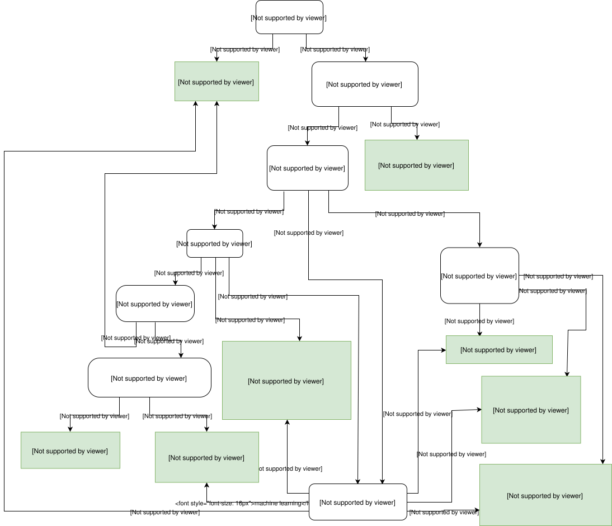
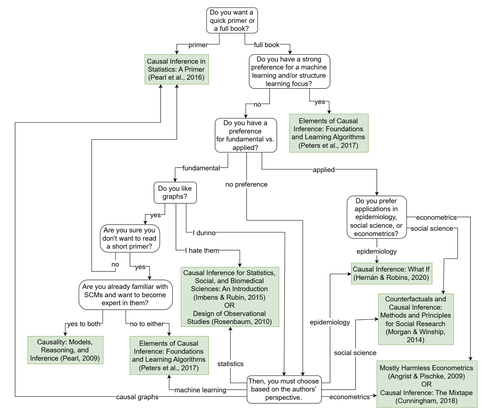
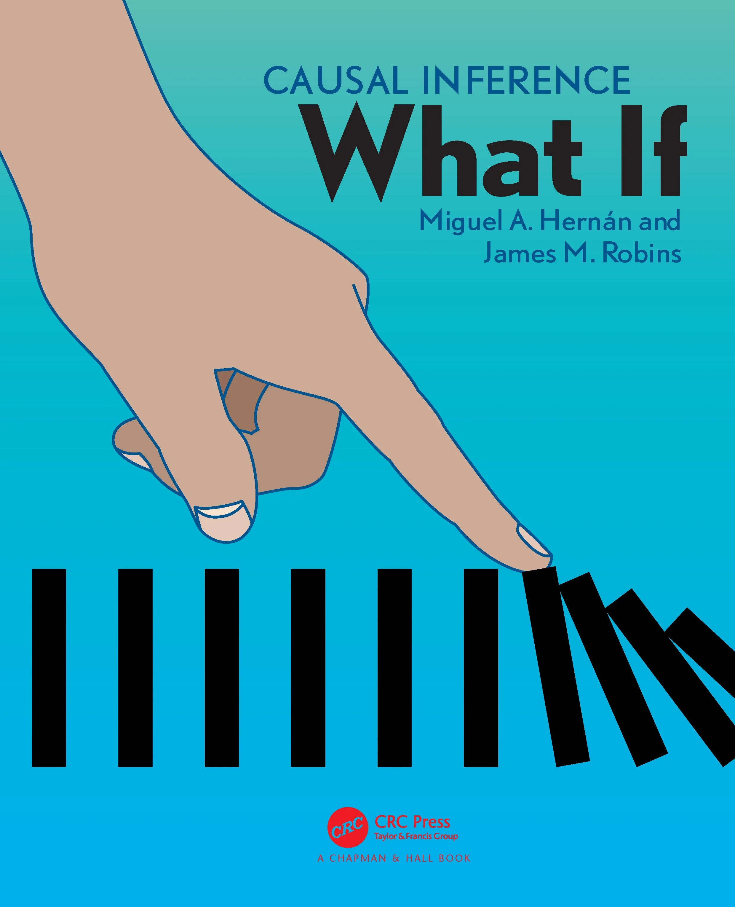

# Key Resources

Throughout the handbook, there are a few key influential texts that have consolidated contemporary methods used to derive causal inferences from observational data. These texts are widely regarded as being foundational to anyone attempting to dip their toes into the field, and are often used as required reading and/or reference material within undergraduate and postgraduate courses in the econometrics, epidemiology, statistics, and social sciences more broadly.

I’ve listed some the most frequently cited texts in this handbook below, along with a brief description of their areas of focus. Additional texts that are beyond the scope of this handbook have also been included for reference. A summary table is also included showing which methods are covered by each book in Section 1.7.

Brady Neal has posted a very useful flowchart on his personal website outlining “which causal inference book you should read,” and covers many of the texts mentioned in this handbook [@nealWhichCausalInference2019]. If you’re completely new to the field of causal inference, his diagram serves as a great place to begin your journey. 

::: {.content-visible when-format="html"}

:::

::: {.content-visible when-format="pdf"}

:::

\

## Causal Inference: What If [@hernanCausalInferenceWhat2025]

::: {.column-margin-right}
{width=250}
:::

Authors:
Miguel Hernan – *Kolokotrones Professor of Biostatistics and Epidemiology, Harvard T.H. Chan School of Public Health & Director of Harvard CAUSALab*
James M. Robins – *Mitchell L. and Robin LaFoley Dong Professor of Epidemiology, Harvard T.H. Chan School of Public Health*

Hernan and Robins’ book was first published in 2020, and has been continuously updated over the past few years. The most up to date version of the book can be found on [Hernan’s personal webpage](https://miguelhernan.org/whatifbook).

The book is considered by many in the field of epidemiology to be the definitive guide to the application of causal inference methods, framed within the target trial emulation framework, especially when it comes to estimating causal effects using complex longitudinal data (with a strong focus on G-methods). This is a result of the book being openly available online for the past two decades while it was still being drafted, with many researchers in the field contributing to the book over this period.

The book is particularly useful in providing guidance for evaluating sustained and time-varying treatment strategies, and overcoming issues such as immortal time bias within classical methods in epidemiology, which are often issues within the field of pharmacoepidemiology.

The book also (very helpfully) includes accompanying R and Stata code hosted on [GitHub](https://remlapmot.github.io/cibookex-r/), which provides practical examples of how the methods covered can be applied to your own data.
