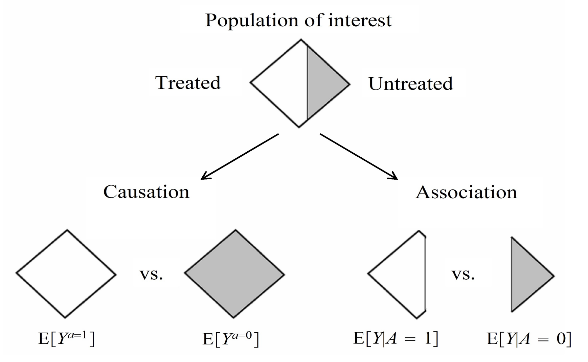

# Randomized Controlled Trials

Before considering specific methods for conducting causal inference, it is worth first considering how randomized experiments, commonly referred to as randomized controlled trials (RCTs), address many of the challenges and issues encountered in observational evaluations of interventions and services, and why it’s considered to be the gold standard for causal inference.

To understand why this is, it’s worth considering the common assumptions present in causal inference methodology covered in section 1.3, and how the fundamental design of RCTs overcome each of these.

\

## Exchangeability

Consider once again the fundamental problem of causal inference: we cannot physically observe both counterfactual outcomes in real life for an individual, one under treatment and the other without. However, this specific difference is inherently what we’re trying to measure, which Hernan and Robins illustrate well in the diagram presented below.

As such, our best option is to establish two groups of individuals that share the same distributions of all relevant characteristics, ideally so close to the point where they are essentially clones of each other. The ideal way to do this is through randomizing study participants to each treatment group, as given a sufficient sample size, participant characteristics should in theory be equally distributed between both groups. Therefore, estimated average treatment effects should be the same regardless of which of the randomized groups actually receives treatment, hence becoming “exchangeable”. Angrist and Pischke summarise this concept quite well:

*“Random assignment works not by eliminating individual differences but rather by ensuring that the mix of individuals being compared is the same”* [@angristMasteringMetricsPath2015]

Of course, given random chance, there is still a possibility that participant characteristics do not end up being completely equally distributed between treatment groups. This can, however, be confirmed through descriptive statistics, and individual covariates can be adjusted for post-hoc as well through regression modelling to ensure exchangeability between treatment groups.

\

## Consistency

In the protocol of an RCT written before patients are recruited, treatment strategies are clearly outlined within trial protocols. Almost all contemporary trials adhere to the CONSORT and SPIRIT checklists, first published in 1996 and 2013 respectively, which provide guidance on recommended items to address within trial protocols [@beggImprovingQualityReporting1996; @chanSPIRIT2013Statement2013; @chanSPIRIT2013Explanation2013]. In particular, the section on interventions in the SPIRIT checklist explicitly states to include information on:

- *“Interventions for each group with sufficient detail to allow replication, including how and when they will be administered.”*
- *“Criteria for discontinuing or modifying allocation intervention for given trial participant (e.g., drug dose change in response to harms, participant request, or improving/worsening disease).”*
- *“Relevant concomitant care and interventions that are permitted or prohibited during the trial.”*
[@chanSPIRIT2013Statement2013]

By explicitly detailing the intervention strategy in advance of carrying out the trial, the treatment strategy each study participant receives is uniformly defined. In other words, this rules out ambiguity in treatment definition: for example, avoiding situations where one participant receives a drug daily while another receives it weekly, or where participants receive different doses of the same drug, despite both being labelled as “treated.” Such variation would undermine the validity of the treatment contrast.

\

## Positivity

Within the SPIRIT checklist, it is also advised that all trials report on the:

“Inclusion and exclusion criteria for participants. If applicable, eligibility criteria for study centers and individuals who will perform the interventions (e.g., surgeons, psychotherapists)” [@chanSPIRIT2013Statement2013].

By explicitly defining what conditions participants would have to meet before becoming eligible for the trial, we ensure that all participants are physically capable of, and hence have a probability greater than zero to adhere to the treatment strategy of interest. 

For example, in a trial evaluating the effect of anticoagulation therapies (e.g., warfarin or a DOAC) in preventing stroke in patients with atrial fibrillation, participants with a history of gastrointestinal bleeding or a known bleeding disorder (e.g., haemophilia) would typically be excluded. Including them would violate the positivity assumption, as it would be medically inadvisable, and therefore impossible to assign them to the treatment arm in the trial.

\

## Stable Unit Treatment Value Assumption (SUTVA)

As a reminder, SUTVA has two distinct requirements:

1.	No multiple versions of treatment
2.	No interference between units

The first of these is already covered by meeting the consistency assumption. However, achieving the no interference requirement is not automatically guaranteed, and requires additional considerations in the design of a trial.

A common method of strengthening the no interference assumption is through blinding, and ideally double-blinding, where neither study participants or investigators are aware of the treatment assigned to each individual. Blinding can help reduce the chances of behavioural changes or spillover effects in study participants compared to if they were aware of the treatment they were assigned to. For example, A study participant who is aware of being on a novel therapy may choose to share their treatment with family members and friends who might be in the control group if they experience an improvement. However, blinding is not always feasible, especially in trials where a specific procedure or physical intervention is visibly administered. 

Physically separating treatment groups may also be an option to address SUTVA, especially for social and public health interventions. Cluster-randomized designs, where entire clusters of individuals (e.g., entire households, schools, or communities) are randomized as a whole to receive an intervention or not. This approach allows the trial to account for interactions between individuals within the same cluster, preserving internal validity by focusing estimation on between-cluster differences in treatment effects.

\

## Other Trial Designs and Further Reading

The picture I’ve painted here is quite simplified though. Aside from standard two-armed trials that I’ve mainly described in this section, many other more intricate designs exist to overcome issues present in such a simple design. I’ve included brief overviews of a selection of alternative designs that would be useful to consider, especially as many of these designs can also be emulated using observational data. Please note that this list is not exhaustive, and is presented more for inspiration on the types of trials you may choose to emulate in a causal inference study of observational data:

\

**Core Designs**

1.	***Parallel Group RCT***  
    This is the conventional two-arm trial that is most commonly considered, where *“patients are randomized to the new treatment or to the standard treatment and followed-up to determine the effect of each treatment in parallel groups”* [@wangClinicalTrialsPractical2006].

    For further details, please refer to the following texts: [@wangClinicalTrialsPractical2006; @pocockClinicalTrialsPractical2013; @piantadosiPrinciplesPracticeClinical2022]

2.	***Crossover Trials***  
    *“Crossover trials randomize patients to different sequences of treatments, but all patients eventually get all treatments in varying order, ie, the patient is his/her own control”* [@wangClinicalTrialsPractical2006].

    For further details, please refer to the following texts: [@wangClinicalTrialsPractical2006; @pocockClinicalTrialsPractical2013; @piantadosiPrinciplesPracticeClinical2022]

3.	***Factorial Trials***  
    *“Factorial trials assign patients to more than one treatment-comparison group. These are randomized in one trial at the same time, ie, while drug A is being tested against placebo, patients are re-randomized to drug B or placebo, making four possible treatment combinations in total”* [@wangClinicalTrialsPractical2006]. 

    *“A factorial structure is the only design that can assess treatment interactions, so this type of trial is required for those important therapeutic questions. When interactions between treatments are absent, which is not a trivial requirement, a factorial design can estimate each of several treatment effects from the same data. For example, two treatments can sometimes be evaluated using the same number of subjects ordinarily used to test a single therapy”* [@piantadosiPrinciplesPracticeClinical2022].

    For further details, please refer to the following texts: [@wangClinicalTrialsPractical2006; @pocockClinicalTrialsPractical2013; @piantadosiPrinciplesPracticeClinical2022]

4.	***Equivalence (Clinical or Bioequivalence), Superiority, & Non-Inferiority Trials***  
    *“A [clinical] equivalence study is designed to prove that two drugs have the same clinical benefit. Hence, the trial should demonstrate that the effect of the new drug differs from the effect of the current treatment by a margin that is clinically unimportant.”*

    A bioequivalence study *“compares the pharmacokinetic (PK) parameters derived from plasma or blood concentrations of the compound,”* in order to understand whether *“the same number of drug compound molecules occupying the same number of receptors will have similar clinical effects.”* 

    *“A superiority study aims to show that a new drug is more effective than the comparative treatment (placebo or current best treatment). Most clinical trials belong to this category.”*

    *“A noninferiority study aims to show that the effect of a new treatment cannot be said to be significantly weaker than that of the current treatment”* [@wangClinicalTrialsPractical2006].

    For further details, please refer to the following texts: [@wangClinicalTrialsPractical2006; @piantadosiPrinciplesPracticeClinical2022]

5.	***Multicenter Trials***  
    *“A multicenter trial is a trial that is performed simultaneously at many centers following the same protocol.”* *“[It] has several advantages over a single-center study, namely: it allows a large number of patients to be recruited in a shorter time; the results are more generalizable and contemporary to a broader population at large; and such studies are critical in trials involving patients with rare presentations or diseases”* [@wangClinicalTrialsPractical2006].

    For further details, please refer to the following texts: [@wangClinicalTrialsPractical2006; @piantadosiPrinciplesPracticeClinical2022]

6.	***Cluster Randomized Trials**  
    *“Cluster randomized trials are performed when larger groups (eg, patients of a single practitioner or hospital) are randomized instead of individual patients.”* *“When individual randomization proves inappropriate, CRTs can be used to reduce the potential for contamination within treatment groups”* [@wangClinicalTrialsPractical2006].

    For further details, please refer to the following texts: [@wangClinicalTrialsPractical2006; @piantadosiPrinciplesPracticeClinical2022]

\

**Advanced Designs (A Non-Exhaustive List of Examples)**

7.	***Adaptive Trials***  
    *“In adaptive trials, patient outcomes are observed and analysed at predefined interim points and predetermined modifications to study design can be implemented based on these observations”* [@bothwellAdaptiveDesignClinical2018].

    For further details, please refer to the following texts: [@jennisonGroupSequentialMethods1999; @bothwellAdaptiveDesignClinical2018; @piantadosiPrinciplesPracticeClinical2022]. In particular, Bothwell et al.’s paper has very handy definitions of different types of adaptive designs within Table 1.

8.	***Stepped Wedge Cluster Randomized Trials***  
    *“A stepped wedge design is a type of crossover design in which different clusters cross over (switch treatments) at different time points. In addition, the clusters cross over in one direction only—typically, from control to intervention.”*

    *“In a parallel or traditional crossover design, the intervention must be implemented in half of the total clusters simultaneously. However, limited resources or geographical constraints may make this logistically impossible. The stepped wedge design allows the researcher to implement the intervention in a smaller fraction of the clusters at each time point”* [@husseyDesignAnalysisStepped2007].

    For further details, please refer to the following texts: [@husseyDesignAnalysisStepped2007; @hemmingSteppedWedgeCluster2015; @piantadosiPrinciplesPracticeClinical2022].

9.	***Master Protocols: Umbrella Trials, Basket Trials, & Platform Trials***  
    *“Master protocols coordinate several closely linked investigations into a single trial, enabling efficient use of resources”* [@piantadosiPrinciplesPracticeClinical2022]. *“Master protocols are often classified into “basket trials”, “umbrella trials”, and “platform trials””* [@parkSystematicReviewBasket2019].

    *“Umbrella trials select patients from a certain disease site (e.g., lung cancer), perform genetic testing on patients, and assign them to multiple treatments according to the matched drug targets.”*

    *“Basket trials take patients from multiple disease sites but with a certain mutation (e.g., BRAF mutation) and assign them to the corresponding target therapy (e.g., BRAF inhibitors).”*

    *“Platform trials provide efficient screening of multiple treatments in a certain disease in which a steady flow of patients is available. A common control group such as the standard of care can be incorporated as the reference groups. New treatments can be added to the platform and evaluated. If a treatment is promising, it can “graduate” and, if a treatment is not promising, it can be dropped from the platform. The trial can run perpetually to efficiently screen for effective treatments”* [@piantadosiPrinciplesPracticeClinical2022].

    For further details, please refer to the following texts: [@parkSystematicReviewBasket2019; @piantadosiPrinciplesPracticeClinical2022].

10.	***Multi-arm Multi-stage Platform Trials***  
    Multi-arm Multi-stage (MAMS) trials are a type of platform trial. *“The MAMS design aims to speed up the evaluation of new therapies and improve success rates in identifying effective ones.”* *“In this framework, multiple experimental treatments are compared against a common control arm in several stages. This approach has several advantages over the more traditional designs since it obviates the need for multiple two-arm studies, and allows poorly performing experimental treatments to be discontinued during the study”* [@piantadosiPrinciplesPracticeClinical2022].

    For further details, please refer to the following texts: [@roystonDesignsClinicalTrials2011; @wasonOptimalDesignMultiarm2012; @wasonRecommendationsMultiarmMultistage2012; @piantadosiPrinciplesPracticeClinical2022].

11.	***Sequential, Multiple Assignment, Randomized Trials (SMART)***  
    *“A SMART is a type of multi-stage, factorial, randomized trial, in which some or all participants are randomized at two or more decision points. Whether a patient is randomized at the second or a later decision point, and the available treatment options, may depend on the patient’s response to prior treatment”* [@kidwellSequentialMultipleAssignment2023].

    For further details, please refer to the following texts: [@piantadosiPrinciplesPracticeClinical2022; @kidwellSequentialMultipleAssignment2023].

