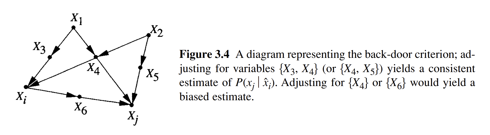
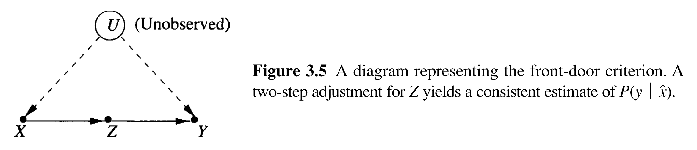
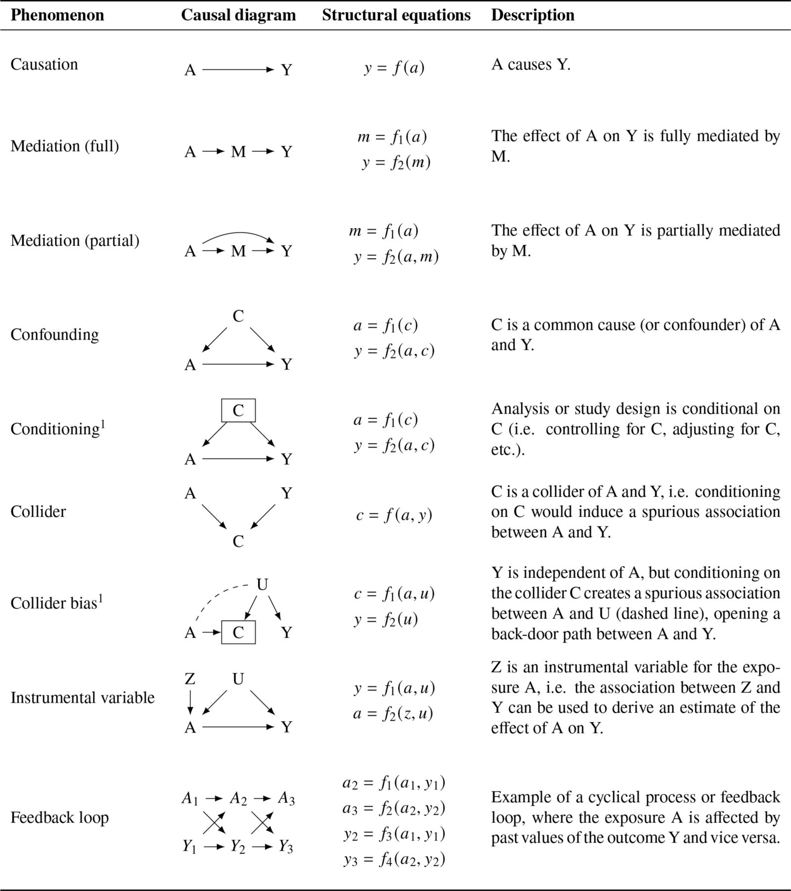

# Directed Acyclic Graphs

## Graphically Representing Causal Relationships

Unlike randomized experiments, when conducting observational studies, we are fundamentally unable to randomize individuals into distinct treatment and control groups, as data was collected retrospectively. Therefore, we have to consider ways to emulate randomized treatment assignment, of which there are various options depending on the evaluation question of interest. 

Before attempting to emulate randomized treatment assignment though, it is strong recommended, especially in the field of epidemiology, to first map out the assumed causal network that links together your treatments, outcomes, as well as any other variables of interest. This process allows us to clarify which confounding variables need to be adjusted for, which can be safely ignored, and which could introduce bias if handled improperly. We can thereby be explicit about the assumptions underlying any statistical models we develop afterwards. The most popular tool for this purpose is the Directed Acyclic Graph, often shortened as DAG. 

While graphical representations of causal relationships have a long history, with DAGs originating from the field of mathematics, specifically graph theory, it wasn’t until one of Pearl’s landmark papers “Causal Diagrams for Empirical Research” where the idea of incorporating causal diagrams in empirical research was first consolidated [@pearlCausalDiagramsEmpirical1995]. Greenland, Pearl and Robins’ similarly notable paper “Causal Diagrams for Epidemiologic Research” published a few years later further extended and popularized these ideas to the field of epidemiology, establishing how DAGs can be used for confounder selection and identifying when incorrectly adjusting for certain variables, known as colliders, may induce biased results [@greenlandCausalDiagramsEpidemiologic1999]. 

\

## An Introduction to DAGs

DAGs are structured with nodes indicating individual variables of interest, connected by one way arrows (referred to as directed edges in mathematics). Unique properties of DAGs are found in their name. They are “directed” given that arrows within them only point in one direction, and “acyclic” due to variables measured at a single time point cannot influence themselves in a feedback loop. If the same variable is measured at multiple time points (e.g., BMI at baseline, at 6 months, at 12 months…), these can be treated as separate nodes to reflect temporal ordering.

Nodes are often described using terminology for a family tree. A variable that causally influences another along a directed path is referred to as an ancestor (or a parent if the influence is direct). Variables that lie downstream (i.e., those that are affected by the ancestor) are called descendants (or children, if directly influenced). These relationships help define how information and causal effects can flow through the DAG.

\

## Blocking Causal Pathways: Frontdoor and Backdoor Adjustment

Pearl’s framework for causal diagrams revolves around the idea of blocking or closing paths through which spurious associations might flow, and is described in great detail in their book “Causality” [@pearlCausalityModelsReasoning2009]. These associations may result from random chance or from unmeasured variables. When estimating causal effects, the goal is to block all non-causal pathways between the treatment and the outcome to eliminate these biases. These pathways fall into two main categories: backdoor and frontdoor paths.

\

## D-Separation

Before going over frontdoor and backdoor paths in detail, it’s worth understanding how paths can be considered open or blocked in a DAG. This is governed by a set of criteria called D-separation, where “D” stands for directional. D-separation provides formal rules for deciding whether one set of variables is statistically independent of another, once we condition on a third set. In other words, it tells us when information can or cannot flow through a path in the graph.

Hernán provides the following succinct definitions of D-separation rules in his free online course about causal diagrams on HarvardX [@hernanCausalDiagramsDraw2017].

1. *“If there are no variables being conditioned on, a path is blocked if and only if two arrowheads on the path collide at some variable on the path.”*
   - The path between A and Y here is blocked by collider L:  
     **A → L ← Y  [Blocked]**
2. *“Any path that contains a noncollider that has been conditioned on is blocked.”*
   - The path between A to Y through B is open here:  
     **A → B → Y  [Open]**
   - However, if we condition on / adjust for B, signified by drawing a box around B, we block the path between A to Y:  
    **A → B → Y  [Blocked]**
3. *“A collider that has been conditioned on does not block a path.”*
   - Previously our path between A and Y here was blocked by collider L:  
     **A → L ← Y  [Blocked]**
   - However, if we condition on / adjust for L, signified by drawing a box around L, we open up the path between A to Y:  
     **A → L ← Y  [Open]**
4. “A collider that has a descendant that has been condition on does not block a path.”
   - Previously our path between A and Y here was blocked by collider L:  
     **A → L ← Y  [Blocked]**
   - However, if we condition on / adjust for a descendant of L, S, signified by drawing a box around S, we open up the path between A to Y:  
     **A → L ← Y  AND  L → S, &nbsp;&nbsp;&nbsp; i.e.,  A → S AND Y → L → S  [Open]**

[@hernanCausalDiagramsDraw2017]

With these rules in mind, we can now continue to how backdoor and frontdoor paths use D-separation to determine which variables to adjust for in our analyses.

\

## Backdoor Paths

A backdoor path is any path from the treatment to the outcome that starts with an arrow pointing into the treatment. These paths generally reflect confounding and can bias the estimate of the treatment effect if not properly addressed. Confounding is a situation where additional variables, known as confounders, distort the causal relationship between the treatment and outcome of interest.

Pearl’s backdoor criterion specifies that we can identify a causal effect of a treatment [A] on an outcome [Y] by adjusting for a set of covariates [Z] if:

1. No variables in the set of covariates [Z] are a descendant of the treatment [A].
   - i.e., they cannot lie on the causal pathway between the  
      **Treatment [A] → Outcome [Y]**
   - Adjusting for a descendant of A (referred to as a mediator) would block part of the causal effect itself, leading to an underestimate of the total effect of treatment [A] on outcome [Y].
2. The set of covariates [Z] blocks every path between the treatment [A] and outcome [Y] that starts with an arrow pointing into the treatment [A] (i.e., all backdoor paths).

When these criteria is met, we can estimate the causal effect by conditioning on the set of covariates [Z], which restores the conditional exchangeability assumption discussed in previous chapters. This is conceptually equivalent to the idea that, once we account for the set of covariates [Z], the assignment of treatment [A] can be considered as good as randomised (i.e., participant characteristics are equally distributed between the treatment groups).

Pearl represented the backdoor criterion in a diagram in his book “Causality” attached below. Adjusting for X~3~ + X~4~ or X~4~ + X~5~ (all of which would be considered confounders in this scenario) would correctly adjust to all backdoor paths, as the remaining variables that are not descendants of Xi would have all their paths connecting X~i~ and X~j~ blocked. 

For example, if X~3~ + X~4~ were adjusted for: 

1. X~1~’s path to X~i~ and X~j~ would be blocked by X~3~ and X~4~
2. X~2~ would only have a path to X~j~ through X~5~, but not to X~i~ as this is blocked by X~4~
3. X~5~ only has a path to X~j~ and not X~i~

If only X4 was adjusted for, a new path between Xi and Xj would be created:  
**X~i~ ← X~3~ ← X~1~ → X~4~ ← X~2~ → X~5~ → X~j~**

This is due to rule #3 of D-separation defined by Hernán, as conditioning on a blocked pathway opens up the path. 

If only X~6~ was adjusted for, we would violate Pearl’s criterion, as the variable is a descendant of X~i~ (i.e., a mediator between X~i~ and X~j~). This would block part of the causal effect between X~i~ and X~j~, biasing results.

\

**A Practical Example**

To provide a practical example of backdoor adjustment, imagine a situation where we wish to evaluate the impact of a community exercise programme on reducing cardiovascular-related hospitalisations:

- *Age and underlying health conditions may affect both the likelihood of participating in the programme and the risk of hospitalisation. These are confounders lying on backdoor paths, which must be blocked by adjusting for them in our analysis to obtain an unbiased estimate of the exercise programme’s effect on cardiovascular-related hospitalisations.*

However, there are some variables which should not be adjusted for:

1.	***Incorrectly adjusting for a collider***  
    Suppose individuals are more likely to receive the programme if they are either highly motivated or referred by their GP due to elevated blood pressure. If we adjust for referral status, which we know to be collider through the following path:  
    Exercise ← Motivation → Referral ← Blood Pressure → Hospitalisation

    If we adjust for referral in a regression model, we’re comparing people with the same referral status. But since referral happens for different reasons, this creates a spurious and false path between motivation and blood pressure. 

    For example, among referred individuals, those who are more motivated are more likely to have lower blood pressure and be healthier overall, thereby inherently having a lower risk of hospitalisation, and vice versa. This leads to selection bias, as the people being compared may already differ in their risk of hospitalisation, even before the programme. As a result, the programme’s effect may be overestimated, not because it’s more effective, but because adjusting for referral has distorted the comparison.

2.	***Incorrectly adjusting for a descendant of the treatment (a mediator)***  
    Suppose we also have access to data on post-programme weight loss. Weight loss lies on the causal pathway between the treatment (participation in the exercise programme) to the outcome (hospitalisations). 
    
    Adjusting for this mediator (a descendant of the treatment) would block part of the causal effect we are trying to estimate, resulting in an underestimate of the total effect of the programme. This violates the backdoor criterion, which explicitly states that descendants of the treatment should not be included in the adjustment set when estimating the total causal effect.

Therefore, DAGs are not only useful in helping identify confounders to adjust for, but also in helping avoid adjustments for variables that would induce bias, either through introducing spurious associations by opening backdoor paths, or through incorrectly adjusting for a mediator.

\

## Frontdoor Paths

A frontdoor path is a path where the causal effect flows from the treatment [A] to a mediator or set of mediators [M], which then influences the outcome [Y]. Under certain assumptions, frontdoor adjustment can be used when backdoor paths cannot be directly blocked.

To use frontdoor adjustment for estimating a causal effect, we must satisfy three criteria:

1. The mediator(s) [M] fully intercepts all directed paths from the treatment [A] to outcome [Y]
   - i.e., there are no direct paths from the treatment [A] to the outcome [Y] that bypasses the mediator(s) [M]  
    **Treatment [A] → Mediator(s) [M] → Outcome [Y]**
2. There are no unblocked backdoor paths  from the treatment [A] to the mediator(s) [M]
   - i.e., there must be no unmeasured confounders between the treatment [A] and the mediator(s) [M]
3. All backdoor paths from mediator(s) [M] to the outcome [Y] are blocked by conditioning on the treatment [A]
   - i.e., there must be no unmeasured confounders between the mediator(s) [M] and the outcome [Y]

Pearl similarly represented the frontdoor criterion in another diagram in his book “Causality” attached below, outlining how it can be used to estimate a causal effect.

In short, the process described in the diagram can be performed as follows:

1. Model the relationship between the treatment [A] and the mediator(s) [M]:
   - Estimate the distribution of the mediator(s) [M] given treatment [A]
   - e.g., fit a regression model where mediator(s) [M] is the outcome and treatment [A] is the predictor
2. Model the relationship between the mediator(s) [M] and the outcome [Y], adjusting for the treatment:
   - Estimate the conditional distribution of the outcome [Y] given mediator(s) [M] and treatment [A]
   - i.e., fit a regression model regressing the outcome [Y] on both mediator(s) [M] and treatment [A]
3. Combine the two models to simulate the total causal effect of the treatment [A] on the outcome [Y]:
   - Use the first model to predict the distribution of the mediator(s) [M] under different values of treatment [A]
   - Then use the second model to estimate the expected outcome [Y] for each predicted value of the mediator(s) [M]
   - Finally, average these predictions to estimate the causal effect of the treatment [A] on outcome [Y]

In essence, this two-step procedure reconstructs the causal effect by tracing how the treatment [A] affects the mediator(s) [M], and how the mediator(s) [M] affects the outcome [Y], bypassing the backdoor pathways (i.e., confounding) that may exist between the treatment [A] and outcome [Y] directly.

Do note, however, that in the field of epidemiology, backdoor adjustment is typically preferred over frontdoor adjustment, as it is often unrealistic to assume that all mediators lying between the treatment and the outcome have been correctly identified and measured. This assumption is essential for valid frontdoor adjustment, but rarely holds when answering causal epidemiological questions using real world data.

\

**A Practical Example**

To provide a practical example of frontdoor adjustment, imagine a situation where we wish to evaluate the effect of an alcohol awareness focused public health campaign on liver disease hospitalisations:

- Say we do not have a measure individual alcohol consumption, which is a major confounder. However, we do observe whether individuals attended alcohol counselling services, which is a mediator between exposure to the public health campaign and liver disease hospitalisation. 
-	If counselling attendance causally affects liver disease risk, and there are no unmeasured confounders on the paths mentioned above, a frontdoor approach could recover the causal effect. 
-	Do note, however, that this approach relies on the strong assumption that alcohol counselling is the only mediator of the campaign’s effect on liver disease. Such an assumption is often implausible in real world settings, where multiple other mechanisms may also mediate the relationship. 

\

## Common Causal Phenomena Illustrated by DAGs

To further consolidate some of the causal phenomena mentioned above which can be illustrated in DAGs, Igelström et al. provide a helpful visual summary of these in their 2022 paper where they present a table of key concepts with visual and text descriptions attached to each [@igelstromCausalInferenceEffect2022]. This is a great point of reference to refer back to while considering whether the use of methods covered in later chapters are appropriate for evaluating your key evaluation question of interest.

\

## Additional Resources

DAGitty is an excellent tool for making your own DAGs, with both an online tool that you can use in your browser, as well as an R package named “dagitty.” The tool also, very usefully, provides information on the minimal adjustment set of variables needed to block all backdoor pathways and estimate an unbiased causal effect after designing a DAG. Both tools can be access through their [website](https://www.dagitty.net/).

If you are interested in getting a more comprehensive overview of DAGs, I would highly recommend auditing the free online HarvardX course [“Causal Diagrams: Draw Your Assumptions Before Your Conclusions”](https://pll.harvard.edu/course/causal-diagrams-draw-your-assumptions-your-conclusions) taught by Hernan as well. 

\

## Statistically Testing the Validity of DAGs

**Further details coming soon**

DAGs can be tested statistically against both continuous and categorical data that you already have within your dataset [@ankanTestingGraphicalCausal2021]... 

Note that although this can help verify the validity of a DAG based on existing data, these methods are unable to help identify whether there are additional variables that are not included in the DAG but should have been present. 

\

## Alternative Methods for Covariate Selection

**Further details coming soon**

There are alternatively automated ways that are used to select variables of interest in situations where you have high dimensional data (e.g., 90k+ vars), this is where LASSO regression might be useful.

However, this comes at the expense of potentially incorrectly adjusting for specific covariates in your models [@lauComparativeEffectivenessSafety2022]…